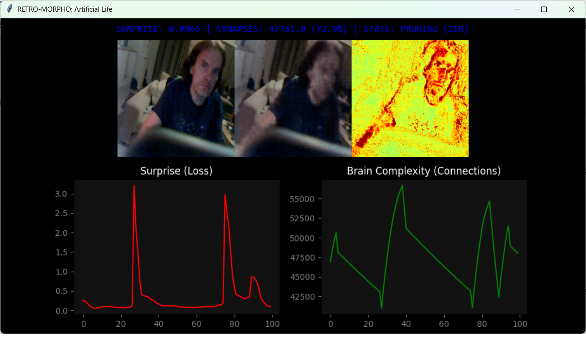

RETRO-MORPHO v2: The Breathing Brain

What is this?
This is not a standard AI model. It is a digital organism that exhibits a metabolism.

Instead of having a fixed architecture, this neural network starts from The Void (0 active connections) and physically grows or shrinks its own brain structure in real-time, reacting to the "stress" of trying to understand your webcam feed.

The Core Logic: "Panic & Zen"
The system operates on a biological cycle of stress and recovery:

❤️ Panic Mode (Adrenaline):

Trigger: You move fast or change the scene.

Reaction: The AI becomes "surprised" (Prediction Error > Average). It realizes its current brain is too simple to handle this new reality, so it force-grows new synaptic connections to absorb the data.

🧘 Zen Mode (Recovery):

Trigger: You sit still or show a static image.

Reaction: The AI becomes "bored" (Prediction Error < Average). It realizes it is wasting energy maintaining a complex brain for a simple task, so it prunes weak connections to become efficient again.

Features
Self-Assembling Topology: It builds its own wiring diagram from scratch. Every connection exists because it fought to exist.

Hypothetical Probes: Before growing, the network simulates "ghost connections" to verify if they would actually help reduce surprise.

Biological Homeostasis: There are no manual learning rate sliders. The system self-regulates its plasticity based on its own anxiety levels.

How to Run It
Requirements:

Python 3.x

PyTorch, OpenCV, NumPy, Matplotlib, Pillow, Tkinter

Installation:

pip install torch numpy opencv-python pillow matplotlib

Usage:

python retro2.py

What to Watch For (The GUI)

The Graphs (The Heartbeat):

Red Line (Surprise): Spikes when you move.

Green Line (Complexity): Watch this closely. Immediately after a Red spike, the Green line will shoot up (growth). As the Red line flattens, the Green line will slowly decay (pruning).

The State: Text at the top will flip between GROWING (PANIC), PRUNING (ZEN), and STABLE.

The Visuals:

Left: Raw Reality (Webcam).

Center: The AI's Dream (Prediction).

Right: The Surprise (The difference between Reality and Dream).

It breathes. It reacts. It grows.
